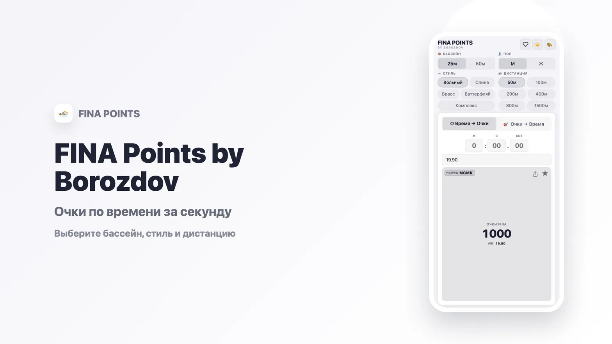

Служебная страница (canon §11): здесь собран каждый элемент Markdown, который умеет блог. При правке стиля смотри сюда в обоих ликах, а не обходи заметки вручную.

## Заголовки

# Заголовок первого уровня

## Заголовок второго уровня

### Заголовок третьего уровня

#### Заголовок четвёртого уровня

##### Заголовок пятого уровня

###### Заголовок шестого уровня

## Текст

Обычный абзац. Бренд говорит кратко и категорично. **Жирный текст**, _курсив_, **_жирный курсив_**, ~~зачёркнутый~~, ==выделение инверсией== и `инлайн-код`. Цифры в тексте: 12:34.56, 1 000 очков, 2026 год.

Ссылки: [внутренняя на главную](index), [внешняя на borozdov.ru](https://borozdov.ru), [[несуществующая заметка]] и голый адрес https://github.com/borozdov.

Сноска в конце предложения.[^1] И вторая.[^2]

[^1]: Текст первой сноски.

[^2]: Текст второй сноски с [ссылкой](https://borozdov.ru).

---

## Списки

- Первый пункт
- Второй пункт
  - Вложенный пункт
  - Ещё один вложенный
- Третий пункт

1. Первый шаг
2. Второй шаг
3. Третий шаг

- [ ] Задача не сделана
- [x] Задача сделана
- [ ] Ещё одна задача

## Цитата

> Власть, уверенность, результат. Монохром без единого цветного оттенка.
>
> — BOROZDOV

## Таблица

| Строка   |    Время |  Значение |
| -------- | -------: | --------: |
| Пример А |  0:12.34 |       100 |
| Пример Б |  1:23.45 |     2 500 |
| Пример В | 12:34.56 |        37 |
| Пример Г |  0:00.01 | 1 000 000 |

## Код

```ts title="metrika.ts"
// Номер счётчика назван ровно в одном месте
export const METRIKA_ID = 109047859

type Goal = "theme_toggle" | "search"

export function trackGoal(goal: Goal, params?: Record<string, string>): void {
  const ym = (window as any).ym
  if (typeof ym !== "function") return
  ym(METRIKA_ID, "reachGoal", goal, params)
}
```

```css
:root[data-theme="obsidian"] {
  --canvas: #0d0d0d;
  --ink: #fafafa;
}
```

```bash
npx quartz build --serve
```

```python
def points(time: float, base: float) -> int:
    """Очки FINA."""
    return round(1000 * (base / time) ** 3)
```

## Выноски

> [!note] Заметка
> Все типы выносок выглядят одинаково: тип различает только иконка.

> [!tip] Совет
> Инверсия — единственный акцент.

> [!info] Информация
> Линии вместо теней.

> [!warning] Предупреждение
> Цветовых литералов вне файла токенов не существует.

> [!danger] Опасность
> Никаких градиентов.

> [!success] Готово
> Проверено в обоих ликах.

> [!question]- Сворачиваемая выноска
> Открывается по клику на заголовок.

> [!quote] Цитата
> Кратко, категорично, без украшений.

## Формулы

Инлайн: $E = mc^2$. Блоком:

$$
P = 1000 \cdot \left(\frac{B}{T}\right)^3
$$

## Изображение



## Компоненты лендинга

<span class="b-label">Лейбл-надзаголовок</span>

<div class="b-actions">
  <a class="b-btn b-btn--primary" href="https://borozdov.ru">Главное действие</a>
  <a class="b-btn" href="https://github.com/borozdov">Вторичное</a>
</div>

<p>
  <span class="b-badge">Инверсия</span>
  <span class="b-badge b-badge--outline">Контур</span>
</p>

<div class="b-card">
  <span class="b-badge b-badge--outline">Проект</span>
  <h3 class="b-card-title"><a href="https://fina.borozdov.ru">FINA POINTS</a></h3>
  <p class="b-card-text">Калькулятор очков FINA по времени заплыва.</p>
  <a class="b-card-cta" href="https://fina.borozdov.ru">Открыть</a>
</div>

<div class="b-links">
  <a href="https://borozdov.ru">borozdov.ru <span>Сайт</span></a>
  <a href="https://razryad.borozdov.ru">razryad.borozdov.ru <span>Нормативы</span></a>
  <a href="https://github.com/borozdov">github.com/borozdov <span>Код</span></a>
</div>
